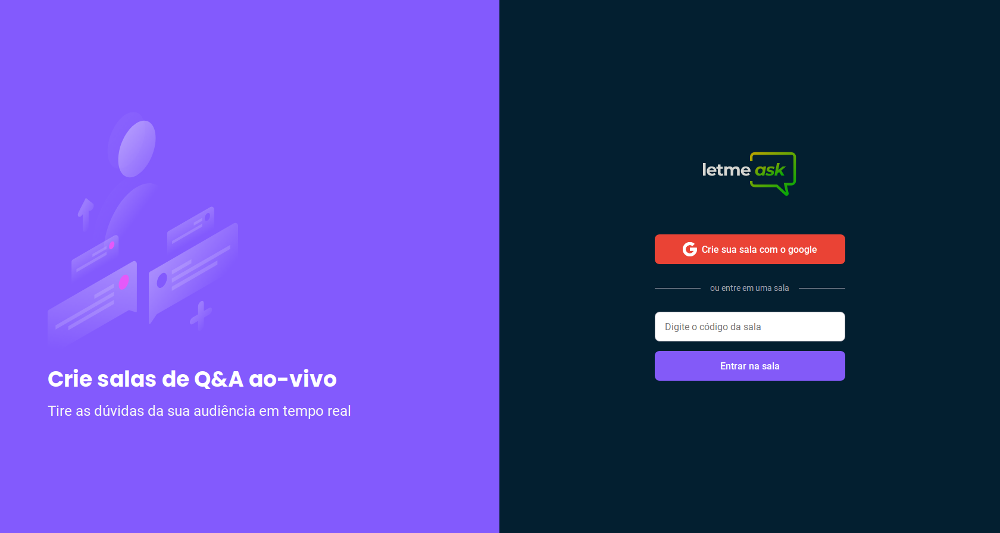

# NLW Together - ROCKETSEAT
Conteúdo aprendido na NLW Together, com algumas implementações de funcionalidades como o dark mode e a verificação de rota para no caso de a sala já estiver sido encerrada ninguém poder acessar via URL

  

### Features
>- Firebase integration
>- ContextAPI (AuthContext, ThemeContext)
>- React Router DOM (navegação entre telas)
>- Criação dos próprios hooks a partir do ContextAPI
>- Dark mode utilizando ContextAPI
>- SASS

Caso queira aprender mais, vou deixar o código público para transmitir o conhecimento :)
